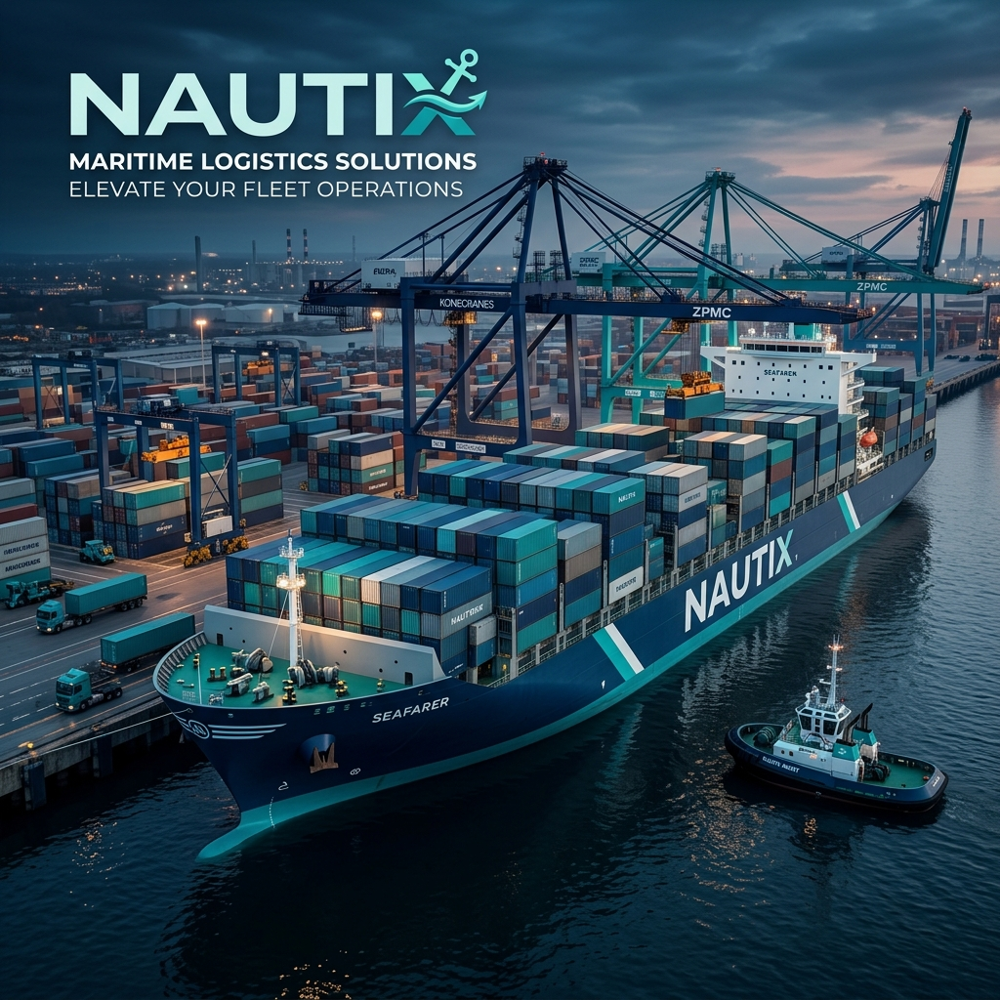
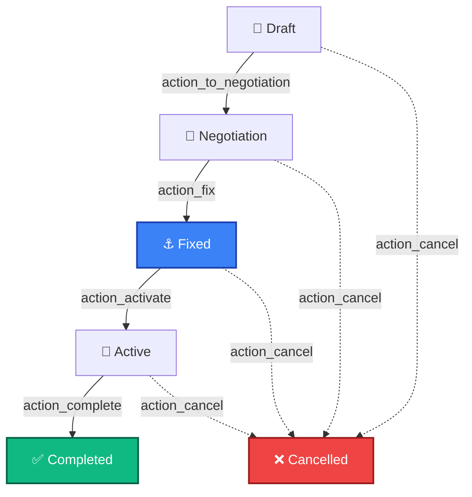

# 🚢 Nautix — The Operating System for Global Maritime Logistics



[](https://odoo.com)
[](https://www.gnu.org/licenses/lgpl-3.0)
[](https://github.com/aaaditt)
[](https://odoo.com)

---

## ⚓ What is Nautix? (The Beginner's Guide)

**Nautix** is a high-performance maritime management suite built on Odoo 19. It simplifies the world of **Ship Chartering** — the process of leasing massive cargo ships to transport goods across oceans.

### ⛴️ Why do you need this?
Imagine you're a company that needs to move 50,000 tons of iron ore from Brazil to China. You don't own a ship, so you "charter" (lease) one. **Nautix** helps you:
- **Find the right ship** for your cargo.
- **Negotiate the lease** (The Charter Party).
- **Track the journey** through every port including live ETAs.
- **Calculate the costs** and automate high-precision billing for the ship's time.

### 🧠 The "Secret Sauce": AI Fleet Intelligence
Nautix features a built-in **Logistics Assistant** powered by AI. It can analyze thousands of vessel specs, current locations, and load capacities in seconds to recommend the perfect vessel for any shipping route, saving hours of manual Excel work.

---

## 💎 Core Features

| Feature | Benefit |
| :--- | :--- |
| **🚢 Fleet Mastery** | Maintain a "Source of Truth" for every ship's technical specs and live status. |
| **🤝 Smart Contracts** | Workflow-driven "Charter Party" agreements from initial draft to final completion. |
| **🗺️ Voyage Pilot** | Real-time tracking of port-to-port legs with automated delay detection. |
| **💳 Seamless Billing** | Automated daily hire rate calculations that sync directly with Odoo Accounting. |
| **🤖 AI Dashboards** | A one-stop command center for fleet analysis and intelligent logistics recommendations. |

---

## 🏗️ Technical Blueprint (Advanced Edition)

The system is built on **6 specialized models**, representing the fundamental pillars of maritime operations.

### 1. ⛴️ Vessel Registry (`nautix.vessel`)
**Purpose:** Stores "Source of Truth" ship specifications and live availability status.
**Mixins:** `mail.thread`, `mail.activity.mixin` (Chatter & Scheduling).

| Spec | Description |
| :--- | :--- |
| **DWT** | Deadweight Tonnage — total cargo + fuel capacity. |
| **IMO Number** | Unique international ship identifier. |
| **Status Sync** | Automatically updates to "On Charter" when a contract is fixed. |

### 2. 📜 Charter Party Engine (`nautix.charter`)
**Purpose:** The central logic core for contract management and financial automation.
**Reference Format:** `CHT/YYYY/0001` (Auto-generated).

### 🔄 Contract Life-Cycle


---

## 📍 Model Registry Summary

| Entity | Role in Module |
| :--- | :--- |
| **Port** (`nautix.port`) | Master data for global loading/discharge hubs. |
| **Cargo** (`nautix.cargo.type`) | Classification engine for various dry and liquid bulk types. |
| **Voyage** (`nautix.voyage`) | Real-time port-to-port tracking legs with ETA/ATA validation. |
| **Invoicing** (`nautix.invoice.line`) | High-precision billing for daily ship-hire rates. |

---

## 🖼️ Views & Interface Gallery

### 📱 AI Dashboard
A custom **OWL (Odoo Web Library)** dashboard featuring the AI Logistics Assistant. It provides a modern, interactive interface for fleet analysis beyond classic Odoo list views.

### ⚓ High-Precision Forms
- **Comprehensive Tabs:** Data organized into "Cargo & Ports", "Financials", and "Voyage Tracking".
- **Real-time Status Bar:** Visual workflow indicator at the top of every charter contract.
- **Full Chatter Support:** Tag colleagues, schedule calls, and log every manual change automatically.

---

## 🛠️ File Structure
```
Nautix/
└── nautix/
    ├── models/ (Business Logic)
    │   └── charter.py, vessel.py, voyage.py...
    ├── views/ (UI Interface)
    │   └── views.xml
    ├── static/ (Frontend Assets)
    │   └── ai_dashboard/ (OWL Components)
    ├── data/ (Initial Metadata)
    │   └── sequences.xml
    └── report/ (Document Automation)
        └── charter_party_report.xml
```

---

## 📦 Getting Started

### 1. Install Dependencies
Ensure you have Odoo 19 and its base requirements installed.
```bash
pip install -r requirements.txt
```

### 2. Deployment
Add the `Nautix` directory to your Odoo `addons_path` and install via the Apps menu or CLI:
```bash
python odoo-bin -i nautix -d [your_database]
```

---

## ❓ Troubleshooting

- **Assets not loading?** Try a hard refresh (`Ctrl + Shift + R`).
- **Model not found?** Upgrade the module (`-u nautix`) to refresh the database registry.
- **AI errors?** Ensure your Gemini API keys are configured correctly in the backend.

---

*Made with ❤️ for the Maritime Industry.*
